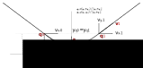

# Overview

Oqual is a small C++ library and rcom application to compute a smooth path
and to control a CNC. 

# Installation

Oquam can be installed separately from the
[romi-rover](https://github.com/romi/romi-rover) suite of models using
the standard cmake approach:


Then proceed to the compilation and installation:
```bash
$ cd oquam
$ mkdir build
$ cd build
$ cmake ..
$ make
```

This creates both the *liboquam* library and the *oquam*
[rcom](https://github.com/romi/rcom) node.

liboquam provides all the functionnality discussed below. It does not
depend on rcom and can be used in other projects.


# Using the library

The header to include is <oquam/oquam.hpp>. The main API is defined by
the abstract class Controller (see Controller.hpp).

The main usage is to instatiate a subclass of Controller that is
implemented for a specific hardware set-up (see below). Next, the
steps to make the CNC travel a smooth path is

* create a new script object,
* register all the points of the polygone path using script_moveto(),
* call controller->run() with the script as argument.

```c++
int main(int argc, char **argv)
{
        double p[][3] = {{0, 0, 0}, ... };
        double v[] = { 0.1, ... };
        int n = sizeof(p) / (3 * sizeof(double));
        Controller *controller = new OquamStepperController(device_name,
                                                    xmax, vmax, amax, deviation,
                                                    scale, period);
        script_t *script = new_script();

        for (int i = 0; i < n; i++)
                script_moveto(script,  p[i].x, p[i].y, p[i].y, v[i], i);

        controller->run(script);                
        delete_script(script);
        delete controller;
}
```

The path planner needs a few parameters in order to compute the smooth
curve:

* xmax: the dimensions of the CNC,
* vmax: the maximum allowed speeds in the x, y, and z directions,
* amax: the maximum allowed accelerations in the x, y, and z directions,
* deviation: the maximum allowed deviation from the theoretical path.

If the deviation is zero, the CNC will reduce the speed to zero in all
the junction points of the path. For larger than zero deviations, the
CNC will curve in the junctions and perform a continuous travel.


## Triggers and delays

It is also possible to insert trigger into the script. Triggers allow
you to synchronise other actions with the traveling of the CNC, for
example, grabbing an image from a camera.

```c++
void do_trigger(void *userdata, int16_t arg)
{
        printf("Trigger %d\n", arg);
}

int main(int argc, char **argv)
{
        double delay = 1.0; // seconds
        // ...

        for (int i = 0; i < n; i++) {
                script_moveto(script,  p[i].x, p[i].y, p[i].y, v[i], i);
                script_trigger(script, do_trigger, NULL, i, delay);
        }
        
        // ...
}
```

During the execution of the script, the trigger's callback function
will be called and the CNC will pause the subsequent move request for
a given delay. If the delay is equal to zero, the CNC will wait
indefinitely, or until controller->continue_script() is called.

You can also add a simply delay into the script using
script_delay(). This may be useful for example if you want to be sure
the CNC is at complete rest before grabbing the image.

## Direct commands

The controller also provides two methods that you can call directly
without creating a script:

* moveat: Move at a given speed in the x, y, and z direction
* moveto: Move to an absolute position


## Controller implementations

Currently, there are two implementations of the controller interface:

* OquamStepperController: A controller for stepper motors. This
  controller connects to an Arduino over a serial connection. The
  Arduino must run the Oquam firmware that is part of [this
  repository](https://github.com/romi/romi-rover/tree/master/oquam/Oquam).

* VirtualStepperController: A virtual stepper controller for testing
  purposes.

Both implementations are a subclass of StepperController, which itself
sublasses Controller.


# Using the rcom node

The oquam node exports the CNC function to other rcom nodes. 


# Implementation

Consider the code below. We have a list of points that we want the
path to go through in the array p[]. For each segment going from
p[i-1] to p[i] the travel speed should be v[i].

```c
double p[][3] = {{0, 0, 0}, ... };
double v[] = { 0.1, ... };
int n = sizeof(p) / (3 * sizeof(double));
Controller *controller = new OquamStepperController("...",
                                                    xmax, vmax, amax, deviation,
                                                    scale, period);
script_t *script = new_script();

for (int i = 0; i < n; i++)
        script_moveto(script,  p[i].x, p[i].y, p[i].y, v[i], i);

controller->run(script);                
delete_script(script);
delete controller;
```

Two segments of the path are shown in the following figure: 


In most cases, there will be a discontinuity in the speed at the
junction point. This discontinuity requires a very high (theoretically
infinite) acceleration. The change in speed corresponds to a change in
value, a change in direction, or both.


In order to remove the dicontinuity and create a smooth path, we
replace the junction with a round curve. During the curve, the speed
has a constant absolute value but changes direction. Before the curve,
the CNC may have to slow down so as to enter the curve with a lower
speed.  After the curve, the CNC may have to speed up again to reach
the desired speed.

The curve introduces an error, as the path no longer goes through the
junction point. When the path is calculated, the application must
therefore specify what the maximum allowed deviation is, that is, the
maxumum allowed distance between the junction point and the curve.


For starters, the speed at the entry of the curve is the minimum speed
of the speed values in segment s[i] and s[i+1]. As we will see below,
the error made by the curve depends on the entry speed and of the
maximum force (read: acceleration) that the motors can apply. 

To define the curve, we have to compute the entry and exit points (the
points q0 and q1 in the figure below), the value of the speed
throughout the curve, and the acceleration that we have to apply. This
calculation is simplified by putting the origin in the junction point
and the xy-plane in the plane defined by the two segments. The x and
y-axes are placed as shown in the figure below.



We will be using the indices 0 and 1, instead of i and i+1, to refer
to the properties before and after the curve.

In this new reference frame, the speed along the x-axis is constant,
*v_x0 = v_x1*. The speed along the y axis reverses, *v_y0 = -v_y1*.

          ∆vy = vy1 - vy0
           
The equation for the speed is (*vy0* and *a* have opposite
signs):

        vy1 = vy0 + a·∆t
        ⇒ ∆t = -2vy0/a                      (1)
          
The equation for the y position is:

        y = y0 + vy0·t + a.t²/2

When t = ∆t/2, y reaches its minimim ym  

        ⇒ ym = y0 + vy0·∆t/2 + a.(∆t/2)²/2, using (1) and develop
        ⇒ ym = y0 - vy0²/2a                                      (2)
          
The time it takes to follow the speed curve is the same as the time it
takes to follow the two segments of the original path that go through
the junction point. This follows from the fact the the speed along the
x-axis remains the same in both cases. Following the orginal straight
path and starting from y0 with a speed of vy0, the junction y=0 is
reached after a time ∆t/2:
          
         y0 + vy0·∆t/2 = 0 ⇒ y0 = vy0²/a                      (3)
          
(2) and (3) combined gives us that:

         ym = vy0²/2a
          
The error ym should be smaller than the maximim deviation d:

          ym < d
          ⇒ vy0²/2a < d
          ⇒ vy0 < √2ad                                          (4)
          
If the requested speed at the entry of the curve is larger than the
√2ad, the speed components in the xyz directions have to scaled
linearly to satisfy the constraint (4).
          
We already calculated the y coordinate of the entry and exit points in
(3). The x coordinates of the entry and exit points are:
          
          ∆x = vx0·∆t
          ⇒ ∆x = -2vy0.vx0/a,   using (1)           
          ⇒ x0 = -∆x/2 = vy0.vx0/a
             and x1 = ∆x/2 = -vy0·vx0/a

To obtain the acceleration to apply on the stepper motors, we have to
rotate the acceleration back from the reference frame above into the
coordinate space of the CNC.


